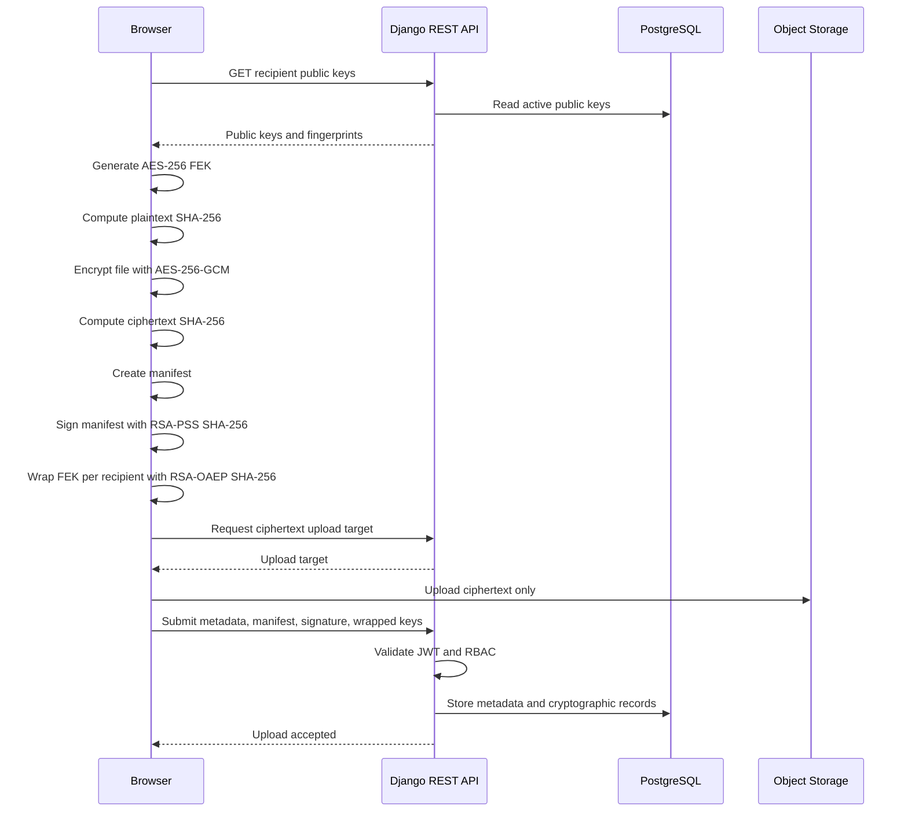
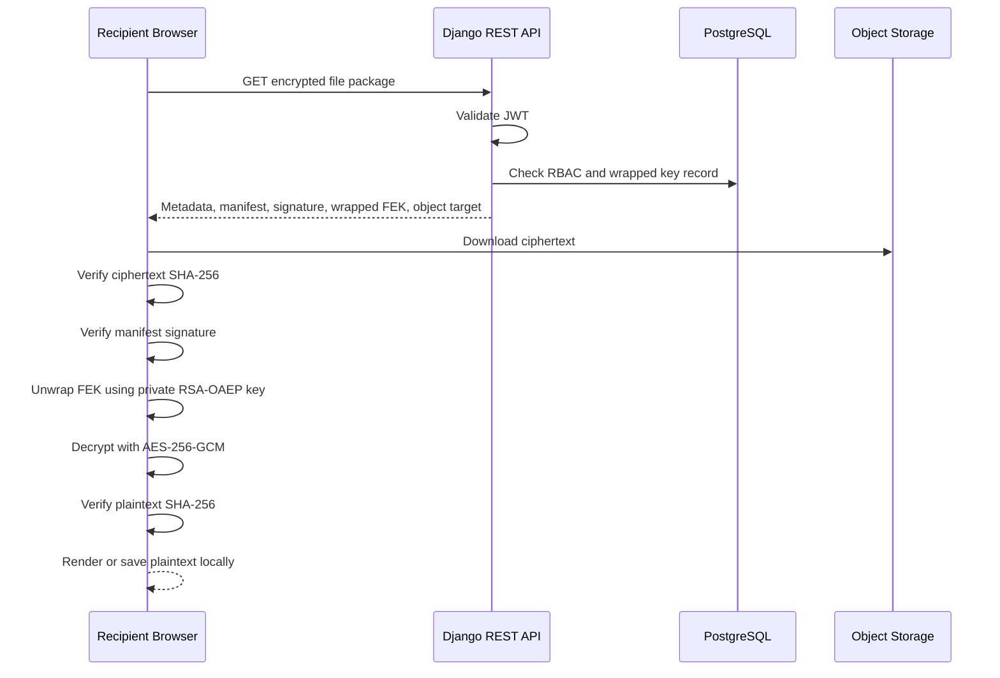

# Secure File Protocol

Protocol specification for the secure academic file sharing and evaluation system.

This document defines the intended end-to-end encrypted file protocol for student submissions, examiner rubrics, evaluation materials, feedback, and signed academic evaluation artifacts.

The design aligns with `PROJECT_STATE.md` and `AGENTS.md`.

## 1. Threat Model Assumptions

The system assumes academic content is sensitive and must remain confidential from infrastructure operators and unauthorized users.

Primary assets:

- student reports and submissions
- examiner rubrics
- evaluation materials
- examiner feedback
- AI Viva Examiner input/output artifacts
- file encryption keys
- user private keys
- signed manifests
- audit records
- RBAC assignments

Assumed adversaries:

- external network attackers
- compromised database
- compromised object storage
- curious or malicious backend operator
- malicious student
- malicious examiner
- stolen JWT bearer token
- public key substitution attacker
- storage tampering attacker
- replay attacker serving old submissions or evaluations
- compromised AI service
- malicious frontend delivery path

Security goals:

- confidentiality of academic content
- integrity of ciphertext and decrypted plaintext
- authenticity of uploader and evaluator actions
- non-repudiation through digital signatures
- role-based server access
- cryptographic recipient-based read access
- tamper-evident protocol behavior

## 2. Trusted vs Untrusted Components

### Trusted Components

The browser is trusted for plaintext handling after the user has loaded an authentic frontend build.

Trusted browser responsibilities:

- generate file encryption keys
- encrypt files before upload
- decrypt files after download
- generate or unlock user private keys
- sign manifests
- verify signatures
- verify hashes
- unwrap AES file keys

### Partially Trusted Components

The Django REST backend is trusted for:

- authentication
- JWT validation
- RBAC enforcement
- API request validation
- metadata routing
- audit logging

The backend is not trusted with:

- plaintext files
- plaintext rubrics
- plaintext evaluations
- private keys
- unwrapped AES file encryption keys

### Untrusted Components

Treat the following as untrusted for confidentiality:

- PostgreSQL
- object storage
- network path
- logs and analytics
- backend file system
- cache layers
- AI service, unless explicitly modeled as a cryptographic recipient

## 3. Algorithm Choices

| Purpose | Algorithm |
|---|---|
| File encryption | AES-256-GCM |
| File encryption key wrapping | RSA-OAEP with SHA-256 |
| Digital signatures | RSA-PSS with SHA-256 |
| Hashing | SHA-256 |
| API authentication | JWT |
| Transport security | TLS 1.3 in production |

Rules:

- Do not invent custom cryptography.
- Do not use AES-CBC, RSA-PKCS#1 v1.5 encryption, raw RSA, or unsigned hashes as authenticity mechanisms.
- Never reuse an AES-GCM key and IV pair.
- Use browser Web Crypto API for cryptographic operations.

## 4. Key Model

Each user has at least two asymmetric key pairs generated client-side:

- RSA-OAEP key pair for file encryption key wrapping.
- RSA-PSS key pair for signatures.

Private keys:

- remain browser-side
- are never sent to the backend
- should be protected by passphrase wrapping, WebAuthn, or device secure storage in future implementation

Public keys:

- are registered with the backend
- include SHA-256 fingerprints
- have active/revoked/expired lifecycle state
- are used by other clients to wrap file keys and verify signatures

Each uploaded file has a unique 256-bit AES file encryption key, also called the FEK.

## 5. Upload Protocol

Upload is a browser-side encryption and signing process. The backend receives only ciphertext metadata and ciphertext object references.

### Upload Steps

1. User selects a file in the browser.
2. Browser checks the user is authenticated and has the required UI permission.
3. Browser requests recipient public keys from the backend.
4. Browser generates a random 256-bit FEK.
5. Browser generates a unique AES-GCM IV.
6. Browser computes SHA-256 of the plaintext file.
7. Browser encrypts the file using AES-256-GCM.
8. Browser computes SHA-256 of the ciphertext.
9. Browser builds the manifest.
10. Browser computes SHA-256 of the canonical manifest.
11. Browser signs the manifest hash using RSA-PSS SHA-256.
12. Browser wraps the FEK once per authorized recipient using RSA-OAEP SHA-256.
13. Browser uploads ciphertext to object storage through a backend-issued upload target.
14. Browser submits encrypted file metadata, manifest, signature, and wrapped key records to the backend.
15. Backend validates JWT and RBAC.
16. Backend validates metadata shape and stores records.
17. Backend never decrypts, unwraps, or inspects file plaintext.

### Upload Sequence Diagram



## 6. Download Protocol

Download is a browser-side verification, key unwrapping, and decryption process.

### Download Steps

1. User requests file metadata.
2. Backend validates JWT.
3. Backend checks RBAC and object access.
4. Backend checks the user has an active wrapped FEK record for the file.
5. Backend returns ciphertext location, file metadata, manifest, signature, uploader public signing key, and the caller's wrapped FEK.
6. Browser downloads ciphertext.
7. Browser computes SHA-256 of ciphertext and compares with metadata and manifest.
8. Browser verifies the manifest signature using uploader RSA-PSS public key.
9. Browser unwraps the FEK with the user's RSA-OAEP private key.
10. Browser decrypts ciphertext with AES-256-GCM.
11. Browser computes SHA-256 of plaintext and compares with manifest.
12. Browser displays or downloads plaintext locally.

### Download Sequence Diagram



## 7. Browser-Side Cryptographic Operations

The browser must perform:

- random FEK generation
- random AES-GCM IV generation
- plaintext SHA-256 hashing
- AES-256-GCM encryption
- ciphertext SHA-256 hashing
- canonical manifest hashing
- RSA-PSS SHA-256 manifest signing
- RSA-PSS SHA-256 signature verification
- RSA-OAEP SHA-256 FEK wrapping
- RSA-OAEP SHA-256 FEK unwrapping
- AES-256-GCM decryption
- plaintext hash verification after decryption

The backend must not perform:

- file decryption
- FEK unwrapping
- private key storage
- plaintext hashing
- plaintext parsing
- plaintext preview generation

## 8. Manifest Structure

The manifest binds encrypted content to academic context and security metadata.

Recommended canonical manifest structure:

```json
{
  "schema_version": "v1",
  "file_id": "temporary-client-id-or-server-id-after-finalization",
  "file_type": "student_submission",
  "owner_user_id": 12,
  "uploader_user_id": 12,
  "course_id": 4,
  "assignment_id": 9,
  "submission_id": 31,
  "object_storage_key": "objects/opaque-ciphertext-id",
  "mime_type": "application/pdf",
  "size_bytes": 742118,
  "plaintext_sha256": "9d2f...",
  "ciphertext_sha256": "41ab...",
  "aes_gcm": {
    "iv": "base64url-encoded-96-bit-iv",
    "tag": "base64url-encoded-tag"
  },
  "recipient_key_fingerprints": [
    "sha256-public-key-fingerprint"
  ],
  "created_at": "2026-05-16T06:30:00Z",
  "purpose": "academic_file_upload"
}
```

Canonicalization rule:

- Before hashing or signing, the manifest must be serialized deterministically.
- Key order, whitespace, encoding, and timestamp format must be stable.
- The implementation should define one canonical JSON serializer before crypto is implemented.

## 9. Digital Signature Workflow

Digital signatures provide authenticity and non-repudiation.

### Signing

1. Browser creates the canonical manifest.
2. Browser computes SHA-256 over the canonical manifest.
3. Browser signs the manifest hash or canonical manifest bytes using the user's RSA-PSS private signing key.
4. Browser sends the signature, signing key ID, algorithm name, and signed payload hash to the backend.

### Verification

1. Browser retrieves the manifest, signature, signer key ID, and signer public key.
2. Browser checks the public key fingerprint against the key registry response.
3. Browser re-canonicalizes the manifest.
4. Browser recomputes SHA-256.
5. Browser verifies the RSA-PSS signature.
6. Browser rejects the file if verification fails.

### Signature Record Example

```json
{
  "signed_by_user": 12,
  "key": 44,
  "signature_algorithm": "RSA-PSS-SHA256",
  "signature_value": "base64url-signature",
  "signed_payload_sha256": "manifest-sha256-hex"
}
```

## 10. Per-Recipient Wrapped AES Key Workflow

The file is encrypted once with AES-256-GCM. The FEK is then wrapped separately for each recipient.

Recipients may include:

- submitting student
- assigned examiner
- assigned project evaluator
- course administrator
- AI Viva Examiner service identity, only when explicitly authorized

### Wrapping Steps

1. Browser fetches each recipient's active RSA-OAEP public key.
2. Browser verifies or displays key fingerprints according to the trust policy.
3. Browser wraps the FEK separately for each recipient using RSA-OAEP SHA-256.
4. Browser sends one wrapped key record per recipient.

### Unwrapping Steps

1. Recipient browser requests encrypted file package.
2. Backend returns only that recipient's active wrapped key record.
3. Browser uses recipient RSA-OAEP private key to unwrap the FEK.
4. Browser decrypts file locally.

Revocation note:

- Removing a wrapped key prevents future backend-mediated downloads by that recipient.
- It cannot make a previously downloaded FEK or plaintext unreadable.

## 11. Integrity Verification Process

Integrity is checked at multiple layers:

1. Ciphertext SHA-256 verifies object storage did not replace the ciphertext blob.
2. AES-GCM authentication verifies ciphertext, IV, tag, and authenticated data consistency.
3. Manifest SHA-256 verifies manifest stability.
4. RSA-PSS signature verifies uploader or evaluator authenticity.
5. Plaintext SHA-256 verifies the decrypted file matches the original uploaded content.

Verification order on download:

1. Validate metadata shape.
2. Verify manifest hash.
3. Verify signature.
4. Verify ciphertext hash.
5. Unwrap FEK.
6. Decrypt AES-GCM.
7. Verify plaintext hash.

If any step fails, the browser must reject the file.

## 12. Tamper Detection Behavior

The browser must fail closed.

| Tampering Event | Detection Mechanism | Required Behavior |
|---|---|---|
| Ciphertext replaced | Ciphertext SHA-256 mismatch, AES-GCM failure | Reject download |
| IV or tag modified | AES-GCM failure, manifest mismatch | Reject download |
| Manifest modified | Manifest hash or RSA-PSS failure | Reject download |
| Signature replaced | RSA-PSS failure | Reject download |
| Wrapped key replaced | RSA-OAEP unwrap failure or AES-GCM failure | Reject download |
| Plaintext mismatch | Plaintext SHA-256 mismatch | Reject rendered file |
| Old manifest replayed | version, submission ID, timestamp, status checks | Reject or warn according to policy |
| Recipient added by backend only | missing signed recipient binding | Warn or reject according to manifest policy |

The UI should clearly distinguish:

- authentication failure
- authorization failure
- cryptographic verification failure
- storage corruption
- unsupported protocol version

## 13. RBAC Interaction with Cryptographic Authorization

RBAC and cryptographic authorization are separate controls.

RBAC answers:

> Is this authenticated user allowed to request metadata or ciphertext for this academic resource?

Cryptographic authorization answers:

> Does this user possess a private key that can unwrap the FEK and decrypt the file?

Required access conditions:

1. User has a valid JWT.
2. User has the required role for the endpoint action.
3. User has object-level access to the course, assignment, submission, or evaluation.
4. User has an active `EncryptedFileKey` record for the requested file.
5. User browser has the matching private RSA-OAEP key.

Important:

- RBAC alone must not grant plaintext access.
- Wrapped keys alone must not bypass backend object-level access checks.
- Backend must not add recipients silently without auditability and manifest policy.

## 14. API Payload Examples

These examples describe protocol shape. Exact implementation may evolve.

### Encrypted Upload Request

```json
{
  "course": 4,
  "assignment": 9,
  "submission": 31,
  "file_type": "student_submission",
  "object_storage_key": "objects/opaque-ciphertext-id",
  "ciphertext_sha256": "41ab...",
  "plaintext_sha256": "9d2f...",
  "aes_gcm_iv": "base64url-iv",
  "aes_gcm_tag": "base64url-tag",
  "size_bytes": 742118,
  "mime_type": "application/pdf",
  "encrypted_filename": {
    "ciphertext": "base64url-encrypted-filename",
    "iv": "base64url-iv",
    "tag": "base64url-tag"
  },
  "schema_version": "v1",
  "manifest": {
    "manifest_json": {
      "schema_version": "v1",
      "file_type": "student_submission",
      "uploader_user_id": 12,
      "course_id": 4,
      "assignment_id": 9,
      "submission_id": 31,
      "plaintext_sha256": "9d2f...",
      "ciphertext_sha256": "41ab...",
      "created_at": "2026-05-16T06:30:00Z"
    },
    "manifest_sha256": "manifest-sha256-hex"
  },
  "encrypted_keys": [
    {
      "recipient_user": 12,
      "recipient_key": 44,
      "wrapped_key_algorithm": "RSA-OAEP-SHA256",
      "wrapped_key_ciphertext": "base64url-wrapped-fek"
    },
    {
      "recipient_user": 27,
      "recipient_key": 51,
      "wrapped_key_algorithm": "RSA-OAEP-SHA256",
      "wrapped_key_ciphertext": "base64url-wrapped-fek"
    }
  ]
}
```

### Manifest Submission

```json
{
  "file_id": 101,
  "manifest_json": {
    "schema_version": "v1",
    "file_id": 101,
    "file_type": "rubric",
    "uploader_user_id": 27,
    "course_id": 4,
    "assignment_id": 9,
    "plaintext_sha256": "f09c...",
    "ciphertext_sha256": "a87b...",
    "created_at": "2026-05-16T07:00:00Z",
    "purpose": "academic_file_upload"
  },
  "manifest_sha256": "manifest-sha256-hex",
  "signature": {
    "signed_by_user": 27,
    "key": 58,
    "signature_algorithm": "RSA-PSS-SHA256",
    "signature_value": "base64url-signature",
    "signed_payload_sha256": "manifest-sha256-hex"
  }
}
```

### Wrapped Key Records

```json
[
  {
    "file": 101,
    "recipient_user": 12,
    "recipient_key": 44,
    "wrapped_key_algorithm": "RSA-OAEP-SHA256",
    "wrapped_key_ciphertext": "base64url-wrapped-fek-for-student"
  },
  {
    "file": 101,
    "recipient_user": 27,
    "recipient_key": 51,
    "wrapped_key_algorithm": "RSA-OAEP-SHA256",
    "wrapped_key_ciphertext": "base64url-wrapped-fek-for-examiner"
  }
]
```

### Encrypted Download Response

```json
{
  "file": {
    "id": 101,
    "file_type": "student_submission",
    "object_storage_key": "objects/opaque-ciphertext-id",
    "ciphertext_sha256": "41ab...",
    "plaintext_sha256": "9d2f...",
    "aes_gcm_iv": "base64url-iv",
    "aes_gcm_tag": "base64url-tag",
    "size_bytes": 742118,
    "mime_type": "application/pdf",
    "schema_version": "v1"
  },
  "download_target": {
    "method": "GET",
    "url": "https://object-storage.example/download-target",
    "expires_at": "2026-05-16T06:40:00Z"
  },
  "manifest": {
    "manifest_json": {
      "schema_version": "v1",
      "file_id": 101,
      "file_type": "student_submission",
      "uploader_user_id": 12,
      "course_id": 4,
      "assignment_id": 9,
      "submission_id": 31,
      "plaintext_sha256": "9d2f...",
      "ciphertext_sha256": "41ab...",
      "created_at": "2026-05-16T06:30:00Z"
    },
    "manifest_sha256": "manifest-sha256-hex"
  },
  "signature": {
    "signed_by_user": 12,
    "key": 45,
    "signature_algorithm": "RSA-PSS-SHA256",
    "signature_value": "base64url-signature",
    "signed_payload_sha256": "manifest-sha256-hex"
  },
  "signing_public_key": {
    "id": 45,
    "key_type": "rsa_pss_signing",
    "public_key_pem": "-----BEGIN PUBLIC KEY-----...",
    "fingerprint_sha256": "public-key-fingerprint"
  },
  "wrapped_file_key": {
    "recipient_user": 27,
    "recipient_key": 51,
    "wrapped_key_algorithm": "RSA-OAEP-SHA256",
    "wrapped_key_ciphertext": "base64url-wrapped-fek-for-current-user"
  }
}
```

## 15. Residual Security Risks

No protocol removes all risk. Important residual risks:

- malicious frontend delivery can steal plaintext or private keys before encryption
- browser malware can read decrypted content or key material
- a compromised backend can deny service
- a compromised backend may hide, reorder, or suppress metadata
- public key substitution remains a risk until key transparency and user-visible fingerprint verification are implemented
- users can leak plaintext after legitimate decryption
- revoked recipients may retain previously downloaded plaintext or FEKs
- AI Viva Examiner plaintext access weakens E2EE unless isolated or client-side
- metadata leakage remains possible through file sizes, timestamps, role assignments, and access patterns

Planned mitigations:

- strict CSP
- deployment integrity controls
- signed frontend builds where practical
- public key transparency
- MFA and device management
- object storage immutability
- audit log review
- encrypted filenames
- minimal metadata retention

## 16. Academic Viva Explanation

The concise explanation:

> The browser encrypts and signs academic files before upload. The backend only authenticates users, enforces RBAC, and stores ciphertext metadata, signatures, manifests, and wrapped file keys. Downloading users must pass RBAC checks and also possess the correct private key to unwrap the AES file key. Integrity is verified through SHA-256 hashes, AES-GCM authentication, and RSA-PSS signatures. Therefore, the server can route and audit academic files without being able to read them.

